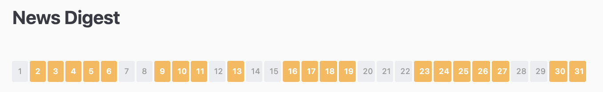
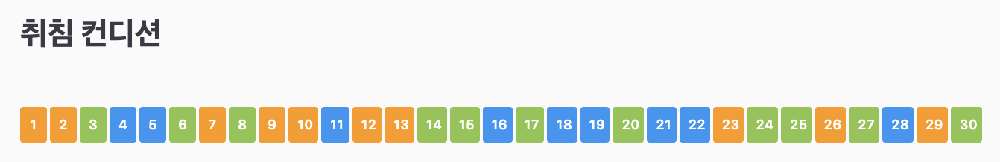
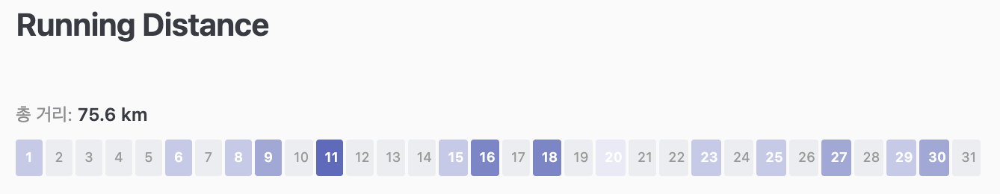
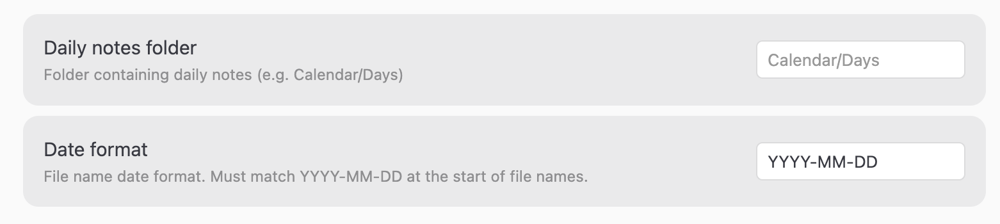

# Monthly Tracker Plugin for Obsidian

일간 노트의 frontmatter 데이터를 읽어 월간 트래커를 시각화하는 Obsidian 플러그인입니다.
습관, 컨디션, 운동, 수면 등 매일 기록하는 데이터를 색상으로 표현해, 한 달간의 패턴과 흐름을 한눈에 파악할 수 있습니다.


---

## 동작 방식

1. **월간 노트** frontmatter에 `year`, `month`를 선언합니다.
2. 플러그인이 일간 노트 폴더에서 `YYYY-MM-DD`로 시작하는 파일을 스캔합니다.
3. 각 일간 노트의 frontmatter 프로퍼티를 읽어 한 달 전체를 셀로 표시합니다.
4. 셀을 클릭하면 해당 날짜의 노트로 이동합니다.

---

## 사전 준비

### 월간 노트

플러그인은 현재 노트의 frontmatter에서 `year`와 `month`를 읽어 어느 달의 일간 노트를 스캔할지 결정합니다. 월간 노트에 반드시 두 필드가 있어야 합니다.

```yaml
---
year: 2026
month: 6
---
```

### 일간 노트

파일명이 설정한 날짜 형식으로 시작해야 합니다. 기본값은 `YYYY-MM-DD`이며, Settings → Monthly Tracker → Date format에서 변경할 수 있습니다.

날짜 이후에 다른 문자가 붙어도 인식됩니다. `2026-06-03.md`, `2026-06-03 Tuesday.md` 모두 인식됩니다.

트래킹할 값은 일간 노트 frontmatter에 기록합니다:

```yaml
---
영어: true
알고리즘문제: true
기상컨디션: good
달린거리: 5.2
수면시간: 7
---
```

---

## 사용법

월간 노트에 `monthly-tracker` 코드블록을 추가합니다:

````markdown
```monthly-tracker
type: boolean
property: 영어
color: blue
```
````

---

## 트래커 종류

### 1. Boolean — 완료 여부

프로퍼티가 `true`인 날을 색으로 표시합니다. 습관 트래킹에 적합합니다.



| 옵션 | 필수 | 설명 |
|------|------|------|
| `type` | ✅ | `boolean` |
| `property` | | 일간 노트의 frontmatter 키 (생략 시 파일 존재 여부를 사용) |
| `color` | ✅ | 프리셋 이름 또는 hex 색상 |
| `source` | | 폴더 직접 지정 (기본 설정 대신 사용) |

#### [boolean] 습관 트래킹 — 프리셋 색상

````markdown
```monthly-tracker
type: boolean
property: 영어공부
color: blue
```
````

#### [boolean] 습관 트래킹 — hex 직접 지정

````markdown
```monthly-tracker
type: boolean
property: 알고리즘문제
color: "#66bb6a"
```
````

#### [boolean] 파일 존재 여부 — `property` 생략

`source`로 지정한 폴더에 파일이 존재하면 해당 날짜에 색이 표시됩니다. 모닝 저널, 식단 일기처럼 frontmatter 없이 파일 생성 자체가 기록인 경우에 유용합니다.

````markdown
```monthly-tracker
type: boolean

source: 04 Calendar/Morning Journals
color: yellow
```
````

---

### 2. Colormap — 카테고리 기록

문자열 값을 색상에 매핑합니다. 컨디션, 기분, 운동 종류처럼 값마다 다른 색을 지정해 분류하고 싶을 때 적합합니다.



| 옵션 | 필수 | 설명 |
|------|------|------|
| `type` | ✅ | `colormap` |
| `property` | ✅ | 일간 노트의 frontmatter 키 |
| `colors` | ✅ | 값 → 색상 직접 지정 |
| `source` | | 폴더 직접 지정 (기본 설정 대신 사용) |

#### [colormap] 운동 종류 — colors 직접 정의

````markdown
```monthly-tracker
type: colormap
property: 운동종류
colors:
  달리기: "#e53935"
  웨이트: "#7986cb"
  요가: "#66bb6a"
  수영: "#29b6f6"
```
````

#### [colormap] 집중도 — 4단계 라벨

````markdown
```monthly-tracker
type: colormap
property: 집중도
colors:
  최상: "#1565c0"
  보통: "#64b5f6"
  저조: "#ffb74d"
  없음: "#e57373"
```
````

---

### 3. Heatmap — 활동량

수치가 클수록 진한 색으로 표시합니다. 수면 시간, 운동 거리, 독서 페이지 등에 적합합니다.



| 옵션 | 필수 | 설명 |
|------|------|------|
| `type` | ✅ | `heatmap` |
| `property` | ✅ | 일간 노트의 frontmatter 키 (숫자) |
| `bins` | ✅ | 단계 구분 기준값 |
| `colorScheme` | | 기본 제공 색상 테마 이름 |
| `colors` | | 단계별 색상 직접 지정 (구간 수 + 1개) |
| `unit` | | 단위 문자열 (툴팁 및 합계에 표시, 예: `km`, `h`, `분`) |
| `showTotal` | | 트래커 위에 월 합계 표시 여부 |
| `totalLabel` | | 합계 레이블 (기본값: `합계`) |
| `source` | | 폴더 직접 지정 (기본 설정 대신 사용) |

#### [heatmap] 달리기 거리 — colorScheme 프리셋

````markdown
```monthly-tracker
type: heatmap
property: 달린거리
colorScheme: indigo
bins: [3, 5, 7, 10]
unit: km
showTotal: true
```
````

`bins: [3, 5, 7, 10]`은 5단계 구간을 만듭니다:

| 구간 | 단계 |
|------|------|
| 0 ~ 3km | 1단계 (연함) |
| 3 ~ 5km | 2단계 |
| 5 ~ 7km | 3단계 |
| 7 ~ 10km | 4단계 |
| 10km 이상 | 5단계 (진함) |

#### [heatmap] 수면 시간 — colors 직접 지정

````markdown
```monthly-tracker
type: heatmap
property: 수면시간
unit: h
bins: [5, 6, 7, 8]
colors:
  - "#ebedf0"
  - "#ffcdd2"
  - "#ef9a9a"
  - "#e57373"
  - "#c62828"
showTotal: true
totalLabel: 이번 달 총 수면
```
````

#### [heatmap] 독서 페이지 — 합계 없이

````markdown
```monthly-tracker
type: heatmap
property: 독서페이지
colorScheme: green
bins: [10, 30, 60, 100]
unit: p
```
````

---

## 색상 프리셋

### Boolean `color` / Heatmap `colorScheme`

| 이름 | 색상 |
|------|------|
| `blue` | #64b5f6 |
| `green` | #66bb6a |
| `red` | #e57373 |
| `purple` | #ba68c8 |
| `orange` | #ffb74d |
| `yellow` | #ffd54f |
| `teal` | #4db6ac |
| `indigo` | #7986cb |
| `pink` | #f06292 |

hex 직접 사용도 가능합니다: `color: "#ff5722"`

Heatmap의 각 테마는 연한 색(데이터 없음/낮음)부터 진한 색(높음)까지 6단계로 구성됩니다. 기본값은 `indigo`.

---

## 설정

Settings → Monthly Tracker:

| 항목 | 기본값 | 설명 |
|------|--------|------|
| **Daily notes folder** | `04 Calendar/Days` | 일간 노트가 있는 폴더 경로 |
| **Date format** | `YYYY-MM-DD` | 파일명의 날짜 형식 |

`YYYY`(연), `MM`(월), `DD`(일) 세 토큰과 구분자를 조합해 설정합니다.

| 설정값 | 인식하는 파일명 예시 |
|--------|----------------------|
| `YYYY-MM-DD` | `2026-06-03.md`, `2026-06-03 Tuesday.md` |
| `YYYY/MM/DD` | `2026/06/03.md` |
| `YYYY.MM.DD` | `2026.06.03.md` |

다른 형식이 필요하다면 PR을 보내주세요.



트래커별로 `source` 옵션을 써서 폴더를 직접 지정할 수 있습니다:

```monthly-tracker
type: boolean

source: 04 Calendar/MorningJournals
color: yellow
```

---

## 월간 노트 전체 예시

```yaml
---
year: 2026
month: 6
---
```

````markdown
### [boolean] English — 프리셋 이름

```monthly-tracker
type: boolean
property: 영어
color: blue
```

### [boolean] Algorithm — hex 직접

```monthly-tracker
type: boolean
property: 알고리즘문제
color: "#66bb6a"
```

### [colormap] 기상 컨디션 — condition 프리셋

```monthly-tracker
type: colormap
property: 기상컨디션
preset: condition
```

### [colormap] 취침 컨디션 — colors 직접

```monthly-tracker
type: colormap
property: 취침컨디션
colors:
  good: "#2196f3"
  soso: "#8bc34a"
  tired: "#ff9800"
  bad: "#f44336"
```

### [heatmap] Running Distance — colorScheme 프리셋

```monthly-tracker
type: heatmap
property: 달린거리
colorScheme: indigo
bins: [3, 5, 7, 10]
unit: km
showTotal: true
```

### [boolean] Morning Journal — 별도 폴더

```monthly-tracker
type: boolean

source: 04 Calendar/MorningJournals
color: yellow
```
````

---

## 트러블슈팅

**`Missing required field: type`** — 코드블록에 `type: boolean` / `colormap` / `heatmap` 중 하나가 있는지 확인하세요.

**`heatmap requires "bins"`** — heatmap 트래커에는 `bins`가 필수입니다. 예: `bins: [3, 5, 7, 10]`

**`Current note must have 'year' and 'month' in frontmatter`** — 월간 노트 frontmatter에 `year`, `month`를 추가하세요.

**셀에 색이 안 칠해짐** — `property` 이름이 일간 노트 frontmatter 키와 정확히 일치하는지, 파일이 설정된 폴더 안에 설정한 날짜 형식으로 시작하는 이름으로 있는지 확인하세요.

---

## 기여

새로운 colormap 프리셋, heatmap 색상 스킴, 기능 추가 등 개선 아이디어가 있다면 PR을 보내주세요.
